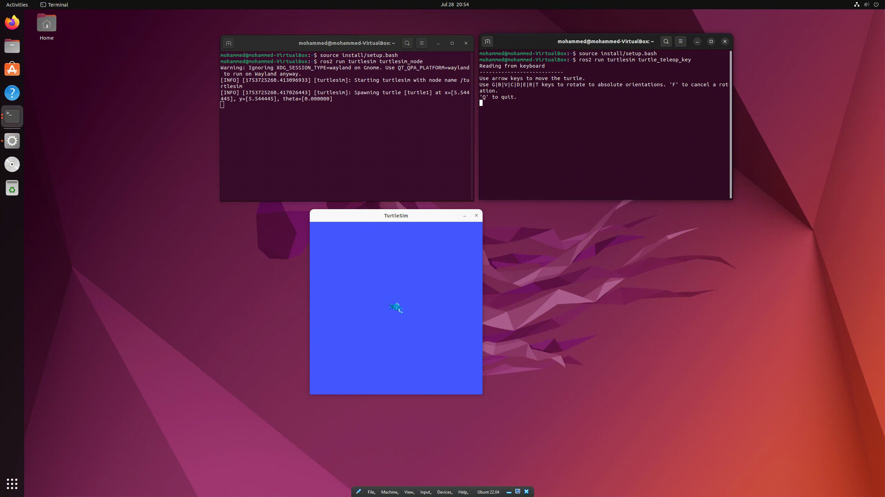

# ROS2 Turtlesim Manipulation

This project demonstrates how to manipulate the **turtlesim** package in **ROS2** using command-line tools and a custom Python node.

---

## ✅ Requirements
- Ubuntu 22.04 (or compatible)
- ROS2 Humble (or your installed version)
- Python 3
- `turtlesim` package

---

## ✅ Quick Setup and Commands

Copy and paste the following commands in your terminal to install, run, and control `turtlesim`:

```bash
# -------------------------
# 1. Source ROS2 environment
# -------------------------
source /opt/ros/humble/setup.bash

# -------------------------
# 2. Install turtlesim package
# -------------------------
sudo apt update
sudo apt install ros-humble-turtlesim

# -------------------------
# 3. Run turtlesim window
# -------------------------
ros2 run turtlesim turtlesim_node

# -------------------------
# 4. Control turtle with keyboard (run in another terminal)
# -------------------------
ros2 run turtlesim turtle_teleop_key

# -------------------------
# 5. List all topics
# -------------------------
ros2 topic list

# -------------------------
# 6. Show velocity messages
# -------------------------
ros2 topic echo /turtle1/cmd_vel

# -------------------------
# 7. Move turtle forward
# -------------------------
ros2 topic pub /turtle1/cmd_vel geometry_msgs/msg/Twist "{linear: {x: 2.0}, angular: {z: 0.0}}"

# -------------------------
# 8. Move turtle in a circle
# -------------------------
ros2 topic pub /turtle1/cmd_vel geometry_msgs/msg/Twist "{linear: {x: 1.0}, angular: {z: 1.0}}"

# -------------------------
# 9. Clear the screen (reset background)
# -------------------------
ros2 service call /clear std_srvs/srv/Empty

# -------------------------
# 10. Teleport turtle to (5,5) position
# -------------------------
ros2 service call /turtle1/teleport_absolute turtlesim/srv/TeleportAbsolute "{x: 5.0, y: 5.0, theta: 0.0}"
